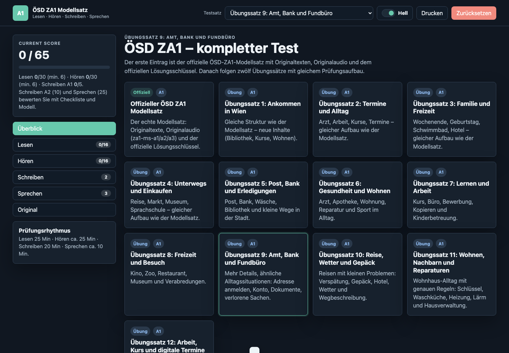
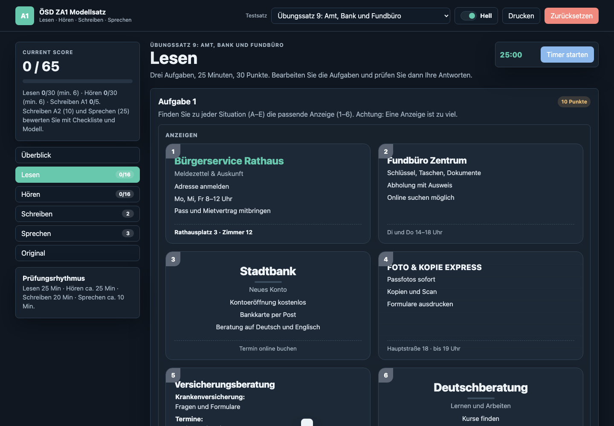
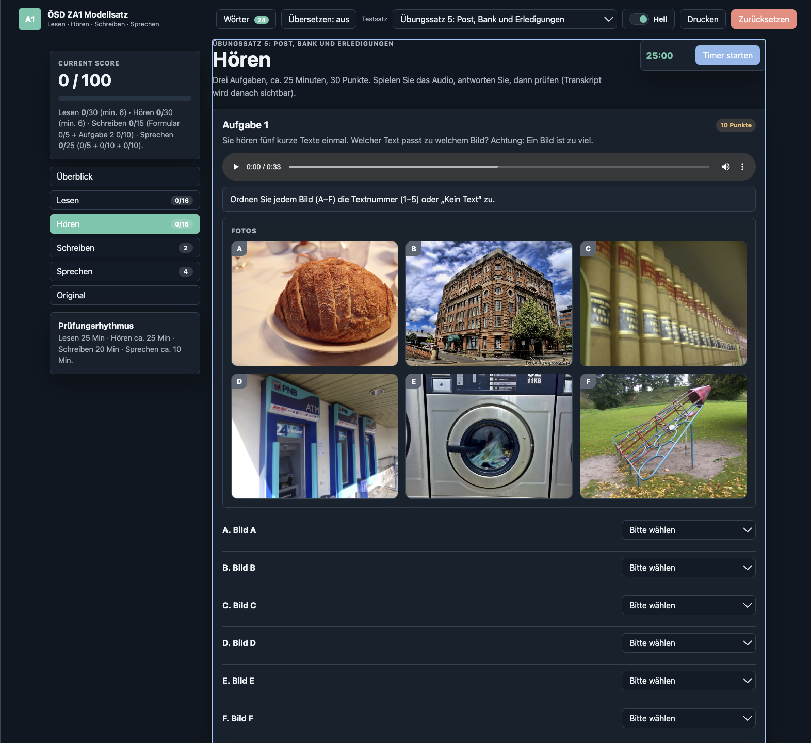
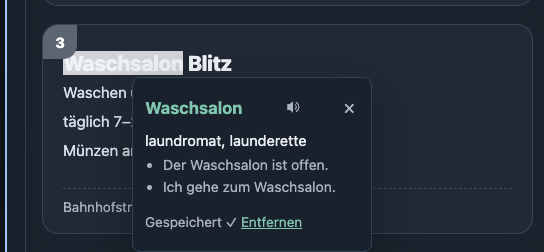
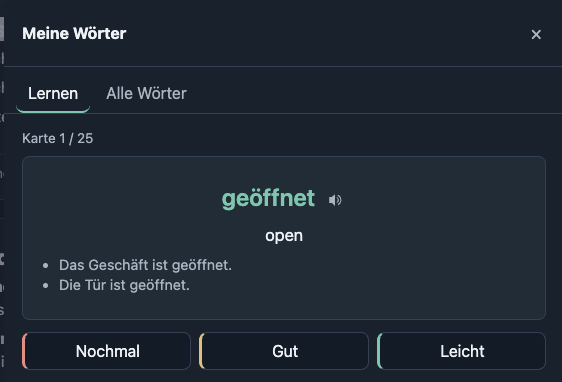
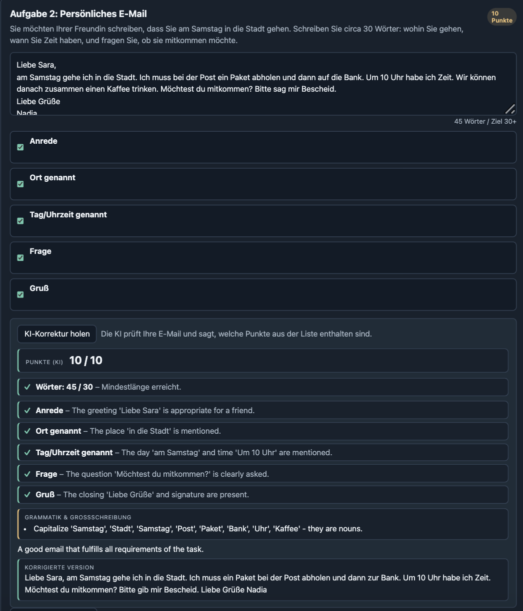
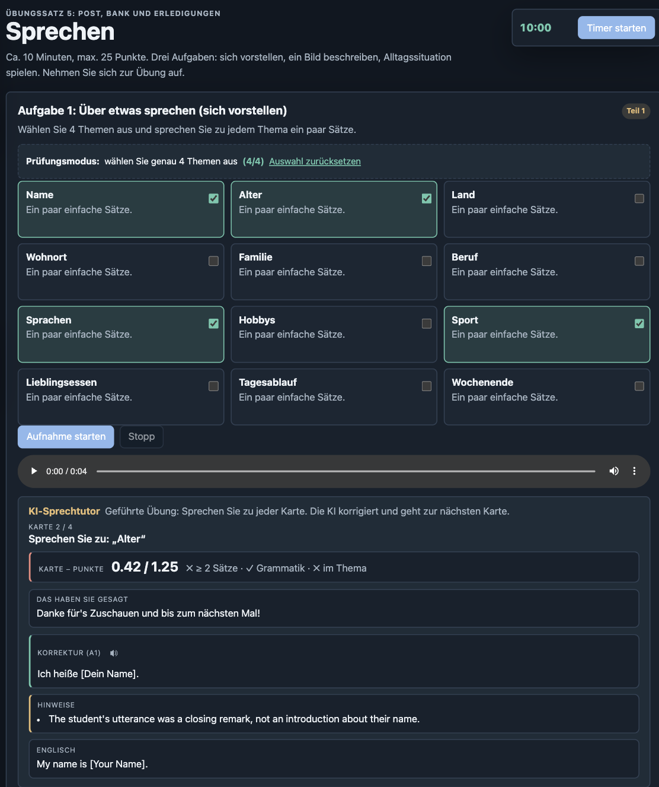
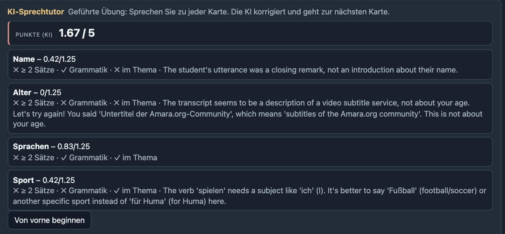

# ÖSD ZA1 German A1 Practice Exam Trainer

A browser-based trainer for the ÖSD *Zertifikat A1 / ZA1* exam format. It pairs the official ÖSD model set (PDF + original audio) with **twelve authored practice exams**, an **AI speaking tutor** that records and corrects spoken German, an **AI email/Brief checker** for Schreiben Aufgabe 2, and a **click-to-translate vocabulary system** with flashcards and German text-to-speech.

The project keeps the static-site spirit — plain HTML, CSS, vanilla JavaScript — and adds a small Node server (no build step, no `npm install`) so API keys can stay off the client.

---

## Screenshots

















---

## What's included

### Exams

- **Official ÖSD ZA1 model set** — the original PDF pages, official audio files, and intact answer key. Kept 1:1 with the source.
- **Twelve practice exams** (Übungssatz 1–12) — authored with the same exam structure: Lesen, Hören, Schreiben, Sprechen. Each piece is a self-contained authored variant; no exam reuses another's prompts.

### Sections per exam

- **Lesen** (30 pts) — three matching/Ja-Nein tasks, automatically scored. Answer keys are deliberately scrambled (no `A=1, B=2, …` patterns).
- **Hören** (30 pts) — photo matching, note-sheet completion, and short interviews. Practice MP3s for every exam, generated through OpenRouter TTS.
- **Schreiben** (15 pts) —
  - *Aufgabe 1*: form fill, auto-scored against the answer key.
  - *Aufgabe 2*: short **E-Mail** (exams 1–5, informal or polite depending on the situation) or formal **Brief** (exams 6–12). A sentence-bank trainer shows useful A1 building blocks for informal email, polite/formal email, or formal letter. The AI checker grades the five required content points, flags German grammar/capitalization issues, counts words, and shows a corrected A1 version.
- **Sprechen** (25 pts) —
  - *Aufgabe 1*: pick **4 of 12** topic cards for *Prüfungsmodus*; the AI tutor walks them one by one.
  - *Aufgabe 2*: picture description across four prompts.
  - *Aufgabe 3*: role-play across four steps.
  - *Aufgabe 4*: extra practice, **Gesprächstraining** — open-ended A1 conversation with partner-style replies and rotating everyday A1 situations. Not part of the scored exam.

### AI features (require the Node server)

- **Speaking tutor.** Record → OpenAI Whisper transcription → A1 tutor correction (Gemini) returning the corrected sentence, mistakes, English translation, and per-card criteria. Click the speaker icon on the *Korrektur (A1)* line to hear the corrected sentence in proper German pronunciation (OpenAI `gpt-4o-mini-tts`).
- **Per-card live scoring.** Each Sprechen card is graded the moment it's recorded against three criteria: ≥ 2 sentences, correct A1 grammar, words on-topic. Points add up to the task's real ÖSD weight (Aufgabe 1: 5, Aufgabe 2: 10, Aufgabe 3: 10).
- **Writing checker.** Submit your Aufgabe 2 text and get a checklist verdict, deterministic word count, grammar/capitalization notes, a corrected version, and a score out of 10.
- **Vocabulary system.** Toggle *Übersetzen* (or press `⌥T`) and click any word in a passage. You get a translation popover with two A1 example sentences; the word is auto-saved to your deck. Drag-select multiple words for a one-off lookup (not saved). Open the **Wörter** modal for flashcard review (front: German + speaker; back: English + examples; rate Nochmal / Gut / Leicht) and an "Alle Wörter" list with delete and TTS.

### Score, total and persistence

The top of the page shows a live **/100** score: Lesen 30 + Hören 30 + Schreiben 15 (Formular 5 + Aufgabe 2 10) + Sprechen 25 (5 + 10 + 10). All progress — answers, writing scores, speaking scores, vocabulary deck — is stored in `localStorage`, scoped per exam. The *Zurücksetzen* button only clears the **current** exam.

### Other niceties

- Light/dark theme, persistent across visits.
- Printable layout.
- Audio source switching between official and practice MP3s.

---

## Requirements

- **Node.js 18+** (for the bundled server — uses `fetch`, `Blob`, and the built-in HTTP module).
- An **OpenRouter API key** (one key powers Whisper STT, Gemini chat, and OpenAI TTS through OpenRouter's unified API).

The browser app itself runs in any modern browser; the AI features need the Node server.

---

## Run locally

1. Clone and `cd` into the project.

2. Create a `.env` file in the project root (gitignored):

    ```ini
    OPENROUTER_API_KEY=sk-or-your-key-here
    ```

    Get a key at [openrouter.ai/keys](https://openrouter.ai/keys). Optional overrides (defaults shown):

    ```ini
    OPENROUTER_CHAT_MODEL=google/gemini-2.5-flash-lite
    OPENROUTER_STT_MODEL=openai/whisper-1
    OPENROUTER_TTS_MODEL=openai/gpt-4o-mini-tts-2025-12-15
    OPENROUTER_TTS_VOICE=nova
    PORT=8096
    ```

3. Start the server:

    ```bash
    node server.mjs
    ```

4. Open `http://localhost:8096/?v=58`.

No dependencies are installed; the server uses only Node's standard library. A plain `python3 -m http.server` will still load the site, but every AI feature (speaking tutor, writing checker, vocab translator, TTS) will fail because there is no `/api/*` route.

---

## Backend API surface

The server (`server.mjs`) exposes four endpoints, all `POST` with JSON bodies. The browser is the only intended caller; the server is local-dev only.

| Endpoint | Purpose |
|---|---|
| `/api/speaking-feedback` | Whisper transcription of recorded audio + Gemini correction (returns `corrected`, `mistakes`, `translation`, `nextQuestion`, and per-card criteria `sentences`/`grammarOk`/`onTopic`). |
| `/api/writing-feedback` | Gemini checker for Schreiben Aufgabe 2 (per-checklist results, grammar/capitalization notes, word count, score out of 10, corrected version). |
| `/api/translate-word` | Word or short-phrase translation with two A1 example sentences. `mode: "word" | "phrase"`. |
| `/api/tts-word` | Returns an MP3 of the supplied text spoken in German (`openai/gpt-4o-mini-tts`). Used by every speaker icon in the UI. |

---

## Project layout

```text
.
├── index.html               # Static shell + cache-busted asset references
├── styles.css               # All styling (light + dark themes)
├── app.js                   # Exam data + rendering + state + AI client calls
├── server.mjs               # Local Node server: static files + /api endpoints
├── docs/screenshots/        # README assets
├── assets/
│   ├── audio/
│   │   ├── official/        # Original ÖSD audio
│   │   └── generated/       # Practice exam MP3s
│   ├── img/
│   │   ├── official/        # PDF page images for the model set
│   │   └── practice/        # Per-exam practice images
│   └── pdf/
└── scripts/
    └── generate-openrouter-tts.mjs   # Bulk TTS generator for practice exams
```

Exam data is defined inline in `app.js`. Audio and image paths are normal static assets — replacing media is usually a matter of preserving the same filename.

---

## Generating practice audio

Practice MP3s live in `assets/audio/generated/` (filenames `exam-N-task-M.mp3`). The TTS generator reads the transcripts from `app.js` and writes new MP3s:

```bash
OPENROUTER_API_KEY=sk-or-... node scripts/generate-openrouter-tts.mjs --exams 9-12
node scripts/generate-openrouter-tts.mjs --exams 8-12 --dry-run
node scripts/generate-openrouter-tts.mjs --exams 12 --tasks 2 --force
```

Existing files are skipped unless `--force` is passed. `.env` is read automatically.

---

## Verification

```bash
# Syntax checks
node --check app.js
node --check server.mjs
node --check scripts/generate-openrouter-tts.mjs

# Every referenced asset exists on disk
node -e 'const fs=require("fs"); const code=fs.readFileSync("app.js","utf8"); const refs=[...code.matchAll(/"(assets\/(?:img|audio|pdf)\/[^"]+)"/g)].map(m=>m[1]); const missing=[...new Set(refs)].filter(p=>!fs.existsSync(p)); console.log(missing.length?missing.join("\n"):"all referenced assets present");'
```

For a real smoke test, start the server and exercise the full flow in a browser: record a Sprechen answer, run the writing checker, click-to-translate a word, replay a flashcard.

---

## Notes

- This is an independent practice tool, **not** an official ÖSD product. The official model set is included as a reference; everything else is authored training material.
- API keys must stay server-side. The browser never sees `OPENROUTER_API_KEY`; all AI calls go through the Node server.
- All learner data (answers, scores, vocab deck) lives in browser `localStorage`. No accounts, no remote storage.
